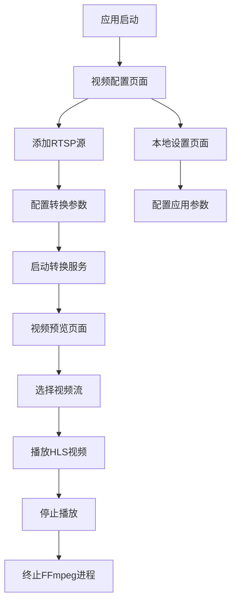

# RTSP转HLS桌面应用产品需求文档

## 1. 产品概述

本产品是一个基于Electron的桌面应用，用于将RTSP视频流转换为HLS格式，提供实时视频预览和流媒体配置管理功能。

- 主要解决RTSP视频流在Web环境下播放兼容性问题，通过FFmpeg转换为HLS格式实现跨平台播放
- 目标用户为需要进行视频流处理的开发者、运维人员和视频监控管理员
- 产品价值在于提供简单易用的视频流转换工具，降低视频流处理的技术门槛

## 2. 核心功能

### 2.1 用户角色

| 角色 | 注册方式 | 核心权限 |
|------|----------|----------|
| 默认用户 | 无需注册，直接使用 | 可使用所有功能模块，包括视频配置、预览和本地设置 |

### 2.2 功能模块

我们的RTSP转HLS桌面应用包含以下主要页面：

1. **视频预览页面**：视频播放器、流状态显示、播放控制
2. **视频配置页面**：RTSP源配置、转换参数设置、流管理
3. **本地设置页面**：应用配置、系统设置

### 2.3 页面详情

| 页面名称 | 模块名称 | 功能描述 |
|----------|----------|----------|
| 视频预览页面 | 视频播放器 | 播放HLS视频流，支持全屏、音量控制、播放暂停 |
| 视频预览页面 | 流状态显示 | 显示当前播放流的状态信息，包括分辨率、码率、帧率 |
| 视频预览页面 | 流选择器 | 从配置的视频流列表中选择要预览的流 |
| 视频配置页面 | RTSP源配置 | 添加、编辑、删除RTSP视频源，包括URL、用户名、密码 |
| 视频配置页面 | 转换参数设置 | 配置FFmpeg转换参数，包括分辨率、码率、帧率 |
| 视频配置页面 | 流管理 | 启动、停止、重启视频流转换，查看转换状态 |
| 本地设置页面 | 应用配置 | 设置输出目录、日志级别等应用参数 |
| 本地设置页面 | 系统信息 | 显示FFmpeg版本、系统资源使用情况 |

## 3. 核心流程

用户首先在视频配置页面添加RTSP视频源，配置转换参数后启动转换服务。FFmpeg进程在后台将RTSP流转换为HLS格式并保存到本地目录。用户可在视频预览页面选择并播放转换后的HLS流。当停止播放或关闭应用时，系统会自动终止相关的FFmpeg进程。

## 4. 用户界面设计

### 4.1 设计风格

- 主色调：#1890ff（Ant Design蓝色），辅助色：#f0f2f5（浅灰色背景）
- 按钮样式：圆角按钮，主要按钮使用蓝色，次要按钮使用白色边框
- 字体：系统默认字体，标题14px，正文12px，小字10px
- 布局风格：左侧导航栏 + 右侧内容区域，采用Ant Design的Layout组件
- 图标风格：使用Ant Design Icons，线性图标风格

### 4.2 页面设计概览

| 页面名称 | 模块名称 | UI元素 |
|----------|----------|--------|
| 视频预览页面 | 视频播放器 | 黑色背景的视频容器，底部播放控制条，支持全屏按钮 |
| 视频预览页面 | 流状态显示 | 卡片式信息展示，包含状态指示灯和文字信息 |
| 视频预览页面 | 流选择器 | 下拉选择框，显示已配置的视频流名称 |
| 视频配置页面 | RTSP源配置 | 表格形式展示，包含添加、编辑、删除操作按钮 |
| 视频配置页面 | 转换参数设置 | 表单形式，包含输入框、选择器和滑块组件 |
| 视频配置页面 | 流管理 | 列表形式，每项包含状态标签和操作按钮 |
| 本地设置页面 | 应用配置 | 表单布局，包含文件夹选择器和开关组件 |
| 本地设置页面 | 系统信息 | 描述列表形式，只读信息展示 |

### 4.3 响应式设计

应用主要面向桌面环境，采用固定布局设计，最小窗口尺寸为1024x768像素，支持窗口缩放但不考虑移动端适配。